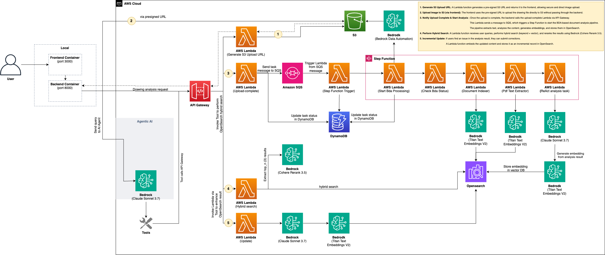

<div align="center">
  
</div>


<h2 align="center"> AWS IDP </h2> 

<div align="center">   
     
     
     
     
   
</div>

---

## Overview

**AWS IDP** is an **AI-powered Intelligent Document Processing solution** designed for unstructured data.  

Transform unstructured data into actionable insights with our advanced AI-powered IDP: Analyze **documents, videos, audio files, and images** with unprecedented accuracy and speed.  

<div align="center">   
   
</div>

---

### Application Demo

For a visual walkthrough of the application's key features, see the [**Application Demo**](docs/demo.md).

---

### Key Features

**Multi-Modal Unstructured Data Processing**

- **Document Processing**
  Content extraction, key data summarization, and layout analysis  
- **Video Analysis** 
  Scene detection, chaptering, and transcript generation  
- **Audio Analysis** 
  Speech-to-text, speaker identification  
- **Image Understanding** 
  Object, scene, and text recognition  

**AI-Powered Automation**

- **Bedrock Data Automation (BDA)**: Fast, scalable OCR + analysis
- **ReAct Agent-based Workflow**: Adaptive tool orchestration for any file type
- **Iterative Reasoning**: Multi-step refinement for accurate outputs

**Hybrid Search System**

- **Semantic + Keyword Search**: Meaning + precision combined  
- **Vector Indexing with OpenSearch**  
- **Real-time Reranking** for best matches

**Conversational AI Interface**

- **MCP Server-based Chatbot**: Natural language Q&A across all content
- **Contextual Conversation**: Multi-turn dialogue with memory
- **Domain-Specific Language Support**

---

### Documentation

- Analysis Pipeline Guide: [Kor](docs/analysis_pipeline_kr.md) / [Eng](docs/analysis_pipeline.md)
- Agent Usage Guide: [Kor](docs/agents_usage_kr.md) / [Eng](docs/agents_usage.md)

---

### System Architecture

See [**Backend System Architecture Overview**](docs/ARCHITECTURE_OVERVIEW.md) for details.

<div align="center">   
   
</div>

---

## Repository Structure

```bash
aws-idp/
├── packages/
│  ├── frontend/                  # Next.js + React user interface
│  ├── backend/                   # FastAPI + MCP Tools + ReAct agent
│  ├── infra/                     # AWS CDK-based infrastructure
│  │  ├── .toml                   # Infrastructure configuration file (e.g., dev.toml)
│  │  ├── deploy-infra.sh         # Deploys core infrastructure (VPC, S3, etc.)
│  │  └── deploy-services.sh     # Optional: Deploys services like ECS and ALB
│  └── results/                   # Analysis results
├── docs/                         # Documentation and diagrams
└── .env                          # Auto-generated env vars
```

---

## Quick Start

Getting started with AWS IDP involves setting up your environment, deploying the necessary cloud infrastructure, and running the application. Choose one of the following environment setup methods.

### **Environment Setup**

You can set up your development environment in one of two ways. The Devcontainer method is recommended for a consistent and automated experience.

#### Quick Deployment & Destroy (CloudShell + CodeBuild) — Recommended First

- Quick Deployment: [Guide](docs/quick_deploy.md) / [Kor](docs/quick_deploy_kr.md)
- Quick Destroy: [Guide](docs/quick_destory.md) / [Kor](docs/quick_destroy_kr.md)

Use these scripts to deploy or remove the stack quickly without local setup. They run from AWS CloudShell and execute via CodeBuild.

| Method                      | Description                                                                                             | Guide                                             |
| --------------------------- | ------------------------------------------------------------------------------------------------------- | ------------------------------------------------- |
| **Manual Local Setup**      | Manually install dependencies on your local machine. For advanced users or specific needs.              | [**Manual Setup Guide**](docs/manual_setup.md) / [**Kor**](docs/manual_setup_kr.md)         |
| **Devcontainer** | A fully containerized environment with all dependencies pre-installed. Requires Docker and VS Code. | [**Devcontainer Setup Guide**](docs/devcontainer_setup.md) / [**Kor**](docs/devcontainer_setup_kr.md) |

After setting up your environment using one of the guides above, proceed with the infrastructure deployment.

---

## **Configuration**

- Infrastructure: packages/infra/.toml
- Env vars: .env (auto-generated)

---

## **Technology Stack**

- **Infrastructure**: AWS CDK, Lambda, DynamoDB, S3, OpenSearch, Step Functions, Bedrock, BDA, SQS
- **Backend**: Python, FastAPI, MCP Tools, ReAct Agent Pattern
- **Frontend**: Next.js 15, React 19, TypeScript

------

## **License**

This project is licensed under the [Amazon Software License](https://aws.amazon.com/asl/).
