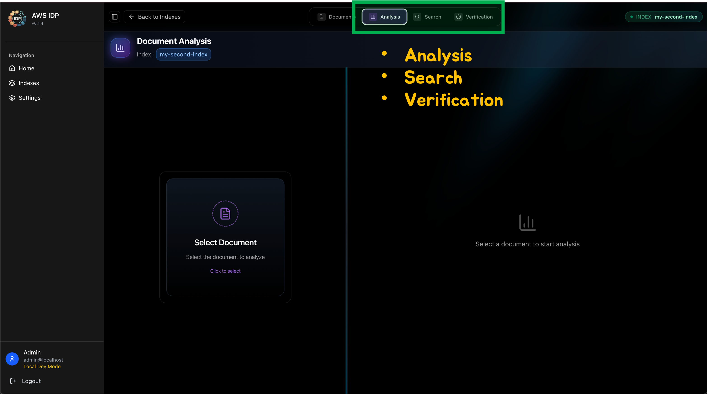

<h2 align="center">Agent Usage Guide (Analysis / Search / Verification)</h2>

This document explains how to use the backend agents and how to extend them (prompts and tools).

---

### 1) Overview
- **Analysis Agent**: Performs analysis tasks based on uploaded documents
- **Search Agent**: Finds related documents/answers using index/search
- **Verification Agent**: Given multiple source documents, validates whether a target document created from them contradicts the sources

   
  

---

### 2) Endpoints / Handlers
- **Backend paths**:
  - `packages/backend/src/routers/analysis_agent.py`
  - `packages/backend/src/routers/search_agent.py`
  - `packages/backend/src/routers/verification.py`

- **Main endpoints**:
  - Analysis Agent (prefix: `/api/strands`)
    - `POST /api/strands/chat`
    - `POST /api/strands/chat/stream`
    - `POST /api/strands/reinit`
  - Search Agent (prefix: `/api`)
    - `POST /api/search`
    - `POST /api/search/stream`
    - `POST /api/search/reinit`
  - Verification Agent (prefix: `/api`)
    - `POST /api/verification`
    - `POST /api/verification/stream`

- **Request/Response schemas (see Pydantic models in files)**:
  - Analysis: `ChatRequest`, `ChatResponse`, `ReinitRequest`, `ReinitResponse`
  - Search: `SearchRequest`, `SearchResponse`
  - Verification: `VerificationRequest`, `VerificationResponse`, `VerificationClaim`

---

### 3) Prompt Structure
- Prompts are managed as YAML files.
- Paths:
  - `packages/backend/src/agent/analysis_agent/prompt/agent_profile.yaml`
  - `packages/backend/src/agent/search_agent/prompt/planner.yaml`
  - `packages/backend/src/agent/search_agent/prompt/responder.yaml`
  - `packages/backend/src/agent/verification_agent/prompt/verification_prompts.yaml`

> [Screenshot placeholder] Prompt template example
> Path: `docs/assets/agent-prompt-example.png`

---

### 4) Tools - Adding / Modifying
- **Verification Agent**: Not intended for external tool additions (uses internal verification pipeline logic)

- **Analysis Agent (Strands-based tools)**
  - Path: `packages/backend/src/agent/analysis_agent/tools/`
  - Example file: `analysis_tools.py`
  - How to add:
    1. Implement a function decorated with `@tool` (see `hybrid_search`, `get_document_info`, etc.)
    2. Ensure the function is imported by the agent (same package or existing module)
    3. Keep I/O simple (strings/IDs). Return shape should be `{ "status": "success|error", "content": [...] }`
    4. If needed, reflect usage guidance (input format/constraints) in prompts

- **Search Agent (MCP-based tools)**
  - Path: `packages/backend/src/mcp_client/` (e.g., `mcp_service.py`, `server/`)
  - Behavior: Connects to MCP servers that provide tools (internal or external)
  - How to add:
    1. Implement or enable tools on the MCP server (for the built-in server, see `mcp_client/server/`; external servers are also supported)
    2. Register the server/tools in the MCP connection settings (e.g., resolved `mcp_config.json` path)
    3. Reinitialize Search Agent to apply changes: `POST /api/search/reinit`

---

### 5) Runtime Parameters (Model ID)
- Model ID is set/overridden in the following routers:
  - Analysis: `packages/backend/src/routers/analysis_agent.py`
  - Search: `packages/backend/src/routers/search_agent.py`
  - Verification: `packages/backend/src/routers/verification.py`
