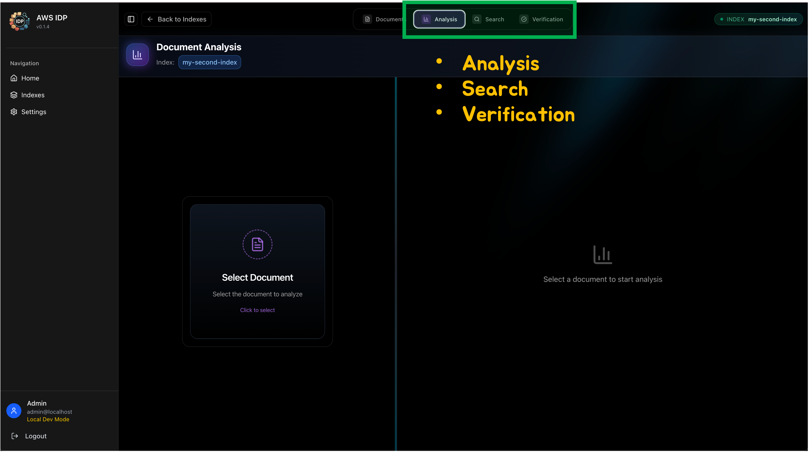

<h2 align="center">에이전트 사용 가이드 (Analysis / Search / Verification)</h2>

이 문서는 백엔드에서 제공하는 에이전트들의 사용법과 확장 포인트(프롬프트 개선, 도구 추가)를 설명합니다.

---

### 1) 개요
- **Analysis Agent**: 업로드된 문서를 기반으로 분석 태스크 수행
- **Search Agent**: 인덱스/검색 기반으로 관련 문서/답변 탐색
- **Verification Agent**: 원본 문서들(복수)을 기준으로, 해당 원본들로부터 작성된 타겟 문서의 내용이 원본에 위배/모순되지 않는지 검증

   
  

---

### 2) 엔드포인트/핸들러
- **백엔드 경로**:
  - `packages/backend/src/routers/analysis_agent.py`
  - `packages/backend/src/routers/search_agent.py`
  - `packages/backend/src/routers/verification.py`
- **주요 엔드포인트**:
  - Analysis Agent (prefix: `/api/strands`)
    - `POST /api/strands/chat`
    - `POST /api/strands/chat/stream`
    - `POST /api/strands/reinit`
  - Search Agent (prefix: `/api`)
    - `POST /api/search`
    - `POST /api/search/stream`
    - `POST /api/search/reinit`
  - Verification Agent (prefix: `/api`)
    - `POST /api/verification`
    - `POST /api/verification/stream`
- **요청/응답 스키마(파일 내 Pydantic 모델 참고)**:
  - Analysis: `ChatRequest`, `ChatResponse`, `ReinitRequest`, `ReinitResponse`
  - Search: `SearchRequest`, `SearchResponse`
  - Verification: `VerificationRequest`, `VerificationResponse`, `VerificationClaim`

---

### 3) 프롬프트 구조
- 프롬프트는 YAML 파일로 관리됩니다.
- 경로:
  - `packages/backend/src/agent/analysis_agent/prompt/agent_profile.yaml`
  - `packages/backend/src/agent/search_agent/prompt/planner.yaml`
  - `packages/backend/src/agent/search_agent/prompt/responder.yaml`
  - `packages/backend/src/agent/verification_agent/prompt/verification_prompts.yaml`

> [스샷 자리] 프롬프트 템플릿 예시
> 경로: `docs/assets/agent-prompt-example.png`

---

### 4) 도구(Tool) 추가/변경
- **Verification Agent**: 별도 도구 추가 대상 아님(검증 파이프라인 내부 로직 사용)
- **Analysis Agent (Strands 기반 툴)**
  - 경로: `packages/backend/src/agent/analysis_agent/tools/`
  - 대표 파일: `analysis_tools.py`
  - 추가 방법:
    1. `@tool` 데코레이터를 사용해 함수 추가(예: `hybrid_search`, `get_document_info` 등과 동일 패턴)
    2. 함수가 에이전트에 import되도록 보장(동일 패키지 내 파일 또는 기존 모듈에 추가)
    3. 입력/출력은 문자열·식별자 위주로 간결하게, 반환은 `{ "status": "success|error", "content": [...] }` 형태 유지
    4. 필요 시 프롬프트에 사용 가이드(입력 포맷/제약) 반영
- **Search Agent (MCP 기반 툴)**
  - 경로: `packages/backend/src/mcp_client/` (예: `mcp_service.py`, `server/`)
  - 동작: MCP 서버가 제공하는 툴을 연결해 사용(외부/내부 MCP 서버 모두 가능)
  - 추가 방법:
    1. MCP 서버에 툴 구현 또는 플러그인 추가(내장 서버는 `mcp_client/server/`, 외부 서버도 가능)
    2. MCP 연결 설정에 서버/툴 등록(기본 경로 예: `packages/backend/src/config/mcp_config.json` — 환경에 따라 path resolver가 위치를 결정)
    3. 서버 실행/접속 확인 후 Search Agent 재초기화(`POST /api/search/reinit`)로 반영

---

### 5) 런타임 파라미터 (Model ID)
- 모델 ID는 아래 라우터에서 설정/오버라이드됩니다.
  - Analysis: `packages/backend/src/routers/analysis_agent.py`
  - Search: `packages/backend/src/routers/search_agent.py`
  - Verification: `packages/backend/src/routers/verification.py`
