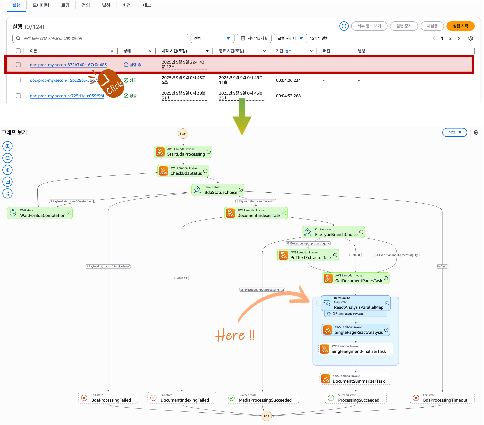
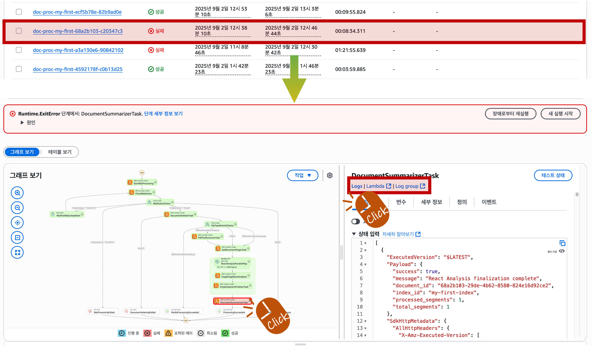

<h2 align="center">Analysis Pipeline Guide (Step Functions)</h2>

This guide covers the end-to-end flow from document upload to analysis execution, progress/error monitoring, log inspection, and parameter/prompt tuning.

---

### 1) Overview
- **Components**: Step Functions (state machine), multiple Lambda functions, S3 (source/intermediate), DynamoDB/Bedrock (optional), CloudWatch Logs
- **Flow**: Upload → Start state machine → Lambda steps → Store results/metadata → Complete/Handle errors

   
  

---

### 2) Document Upload
- **Upload bucket**: `s3://aws-idp-ai-documents-<accountId>-<region>-<stage>`
- **Storage path structure**: Files are stored under `indexes/<index-name>/documents/`
- **Supported types and size**: documents (PDF, DOC, TXT), images (PNG, JPG, GIF, TIFF), videos (MP4, MOV, AVI), audio files (MP3, WAV, FLAC) up to 500MB

---

### 3) Run Analysis (Step Functions)
- The Step Functions console provides a clear view of analysis executions.
- The execution list shows states like `Running`, `Succeeded`, and `Failed`.
- Click a running execution to open the execution graph; the current step is highlighted.
- Click any step to view its input/output and a brief error summary.

   
  

---

### 4) Progress Monitoring and Troubleshooting
- If an execution fails, click the failed item and check the execution graph to identify the failed step.
- Click the failed step and use the "Logs" button to see a brief log snippet.
- For detailed logs, click the "Log group" button to open the related CloudWatch Logs group.
- Use the "Lambda" button to navigate to the Lambda function console for that step.

   
  

---

### 5) Logs (CloudWatch)
- **Lambda log group**: `/aws/lambda/<function-name>`
- **Key function names**:
  - `aws-idp-ai-bda-processor`
  - `aws-idp-ai-bda-status-checker`
  - `aws-idp-ai-document-indexer`
  - `aws-idp-ai-pdf-text-extractor`
  - `aws-idp-ai-get-document-pages`
  - `aws-idp-ai-vision-react-analysis`
  - `aws-idp-ai-analysis-finalizer`
  - `aws-idp-ai-document-summarizer`

- **How to find logs**:
  - From the Step Functions execution details, click the step of interest → use "Logs" or "Log group" to open related logs
  - Or go to the target Lambda in AWS Console → Monitoring tab → "View logs in CloudWatch"
  - Log groups follow `/aws/lambda/<function-name>`; check the latest log stream for error stacks and structured logs

   
  

---

### 6) Pipeline Parameters and Tuning
- **Config file location**: `packages/infra/.toml` (takes effect when infra is redeployed)

- **Key sections**:
  - [bedrock]
    - **analysisAgentModelId / analysisAgentMaxToken**: LLM model / max tokens for the analysis agent
    - **analysisImageModelId / analysisImageMaxToken**: Model / max tokens for image analysis
    - **analysisVideoModelId**: Video analysis model ID (e.g., TwelveLabs)
    - **analysisSummarizerModelId / analysisSummarizerMaxToken**: Model / max tokens for document-level summary
    - **pageSummaryModelId / pageSummaryMaxToken**: Model / max tokens for page-level summary
    - **embeddingsModelId / embeddingsDimensions**: Embedding model and vector dimensions
    - **rerankModelId**: Re-ranking model ID
    - **vectorWeight / keywordWeight / searchThresholdScore**: Hybrid search weights and threshold
  - [analysis]
    - **previousAnalysisMaxCharacters**: Max characters to keep from previous analysis context
    - **maxIterations**: Upper bound for ReAct reasoning iterations
  - [stepfunctions]
    - **documentProcessingTimeout**: Overall workflow timeout (minutes)
    - **maxConcurrency**: Concurrency for `ReactAnalysisParallelMap`
  - [lambda]
    - **timeout / memorySize / runtime**: Default Lambda timeout (seconds), memory, and runtime
  - [search]
    - **hybridSearchSize / rerankTopN / maxSearchSize / rerankScoreThreshold**: Candidate size, rerank return size, max search size, rerank threshold

- **Quick tuning without redeploy**
  - Go to AWS Console → Lambda → function `aws-idp-ai-vision-react-analysis-<stage>` (e.g., `-dev`) → Configuration → Environment variables
  - Common keys you can adjust:
    - `BEDROCK_AGENT_MODEL_ID`, `BEDROCK_AGENT_MAX_TOKENS`
    - `BEDROCK_IMAGE_MODEL_ID`, `BEDROCK_IMAGE_MAX_TOKENS`
    - `MAX_ITERATIONS`, `PREVIOUS_ANALYSIS_MAX_CHARACTERS`
  - Effect: Applied to new invocations for the analysis step. Redeployments using `.toml` may overwrite console changes; once stabilized, mirror changes in source as well.

   
  

---

### 7) Prompt Locations
- **Files**:
  - `packages/infra/src/functions/step-functions/vision-react/prompts/reactor.yaml` (ReAct agent system/user templates)
  - `packages/infra/src/functions/step-functions/vision-react/prompts/responder.yaml` (Final response synthesis)
  - `packages/infra/src/functions/step-functions/vision-react/prompts/image_analyzer.yaml` (Deep image analysis)
  - `packages/infra/src/functions/step-functions/vision-react/prompts/video_analyzer.yaml` (Video chapter analysis)
- **How changes are applied**: Prompts are packaged with the Lambda code and applied on deployment.
- **Best practices**: Keep a consistent structure, maintain Korean language directives as needed, verify placeholders (`{{...}}`).
- **Edit directly in Lambda (fast experiments)**
  - AWS Console → Lambda → `aws-idp-ai-vision-react-analysis-<stage>` → Code tab → edit and Deploy:
    - `step-functions/vision-react/prompts/reactor.yaml`
    - `step-functions/vision-react/prompts/responder.yaml`
    - `step-functions/vision-react/prompts/image_analyzer.yaml`
    - `step-functions/vision-react/prompts/video_analyzer.yaml`
  - Changes take effect for new requests; due to warm environments, propagation may take a few minutes.
  - Note: Later CDK redeploys can overwrite console edits, so commit stabilized changes to source control.

   
  

---

### 8) Common Issues and Remedies
- Model/region not supported: verify Bedrock model availability in the region or switch model ID
- Token limit exceeded: reduce `MAX_TOKENS` or apply document chunking strategies
- Timeouts: increase Lambda timeout/memory and check retry settings for steps
- Cost/quotas: verify service quotas and concurrency/throughput limits

