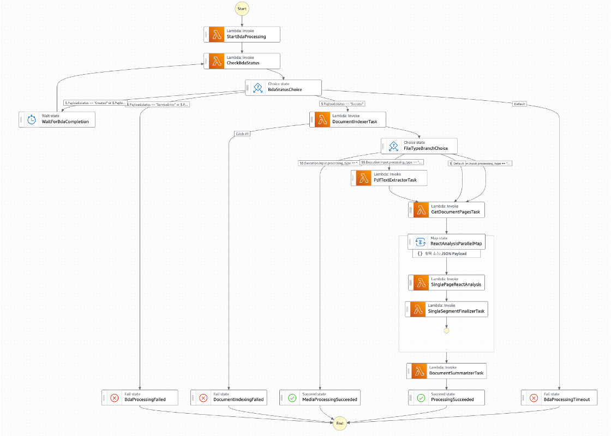
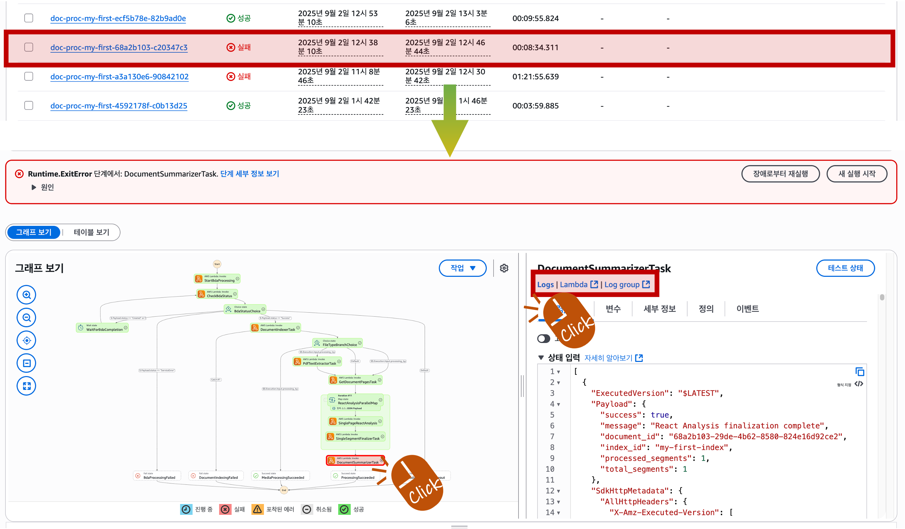
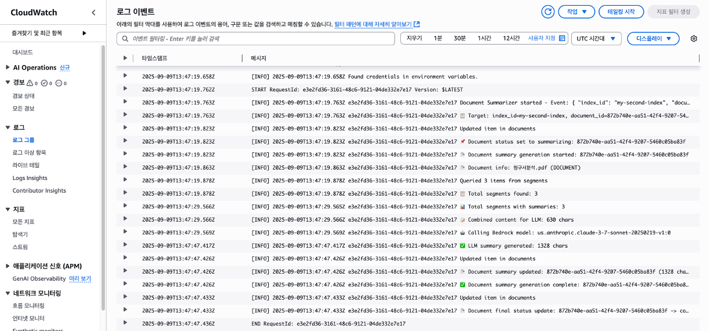
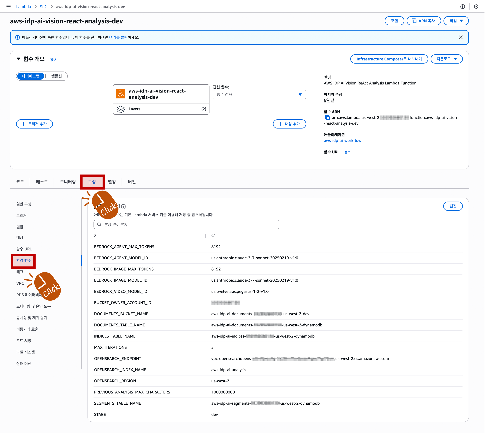
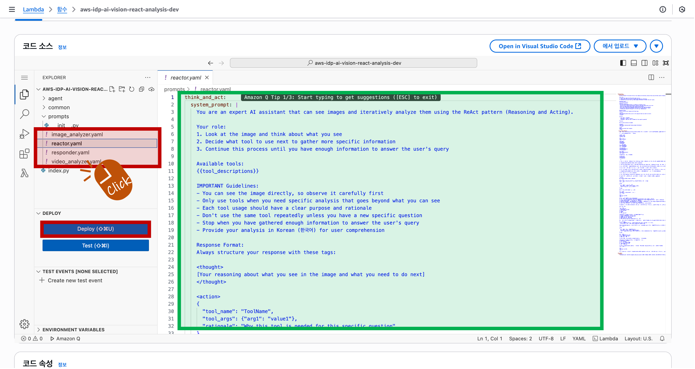

<h2 align="center">분석 파이프라인 가이드 (Step Functions 기반)</h2>

본 문서는 문서 업로드부터 분석 실행, 진행상황 및 오류 확인, 로그 조회, 파라미터/프롬프트 변경 방법까지 전체 플로우를 설명합니다.

---

### 1) 개요
- **구성요소**: Step Functions(상태머신), Lambda(여러 단계), S3(원본/중간결과), DynamoDB/Bedrock 등(옵션), CloudWatch Logs
- **흐름**: 업로드 → 상태머신 시작 → 단계별 Lambda 실행 → 결과/메타데이터 저장 → 완료/오류 처리

   
  

---

### 2) 문서 업로드
- **업로드 버킷**: `s3://aws-idp-ai-documents-<accountId>-<region>-<stage>`
- **저장 경로 구조**: `indexes/<index-name>/documents/` 하위에 파일 저장
- **지원 형식 및 용량**: documents (PDF, DOC, TXT), images (PNG, JPG, GIF, TIFF), videos (MP4, MOV, AVI), audio files (MP3, WAV, FLAC) up to 500MB

---

### 3) 분석 실행 (Step Functions)
- Step Functions 콘솔에서 문서 분석의 실행 현황을 한눈에 확인할 수 있습니다.
- 실행 목록에는 `실행 중`, `성공`, `실패` 등 상태가 표시됩니다.
- 실행 중인 항목을 클릭하면 실행 그래프가 열리고, 현재 진행 중인 단계가 하이라이트됩니다.
- 각 단계를 클릭하면 해당 단계의 입력/출력과 오류 메시지 요약을 바로 볼 수 있습니다.

   
  

---

### 4) 진행상황 확인 및 오류 파악
- 실행이 실패했다면, 실패한 실행 항목을 클릭하여 실행 트리(그래프)에서 실패된 스텝을 확인합니다.
- 실패한 스텝을 클릭한 뒤 우측의 "Logs" 버튼을 누르면 간략 로그를 바로 볼 수 있습니다.
- 더 자세한 로그가 필요하면 "Log group" 버튼을 눌러 CloudWatch에서 해당 로그 그룹의 상세 로그를 확인합니다.
- "Lambda" 버튼을 누르면 해당 스텝이 호출한 Lambda 함수 콘솔로 이동할 수 있습니다.

   
  

---

### 5) 로그 확인 (CloudWatch)
- **Lambda 로그 그룹**: 기본 형식 `/aws/lambda/<function-name>`
- **주요 함수 이름**:
  - `aws-idp-ai-bda-processor`
  - `aws-idp-ai-bda-status-checker`
  - `aws-idp-ai-document-indexer`
  - `aws-idp-ai-pdf-text-extractor`
  - `aws-idp-ai-get-document-pages`
  - `aws-idp-ai-vision-react-analysis`
  - `aws-idp-ai-analysis-finalizer`
  - `aws-idp-ai-document-summarizer`

- **찾는 요령**:
  - Step Functions 실행 상세 화면에서 실패(또는 관심) 스텝을 클릭 → 우측의 "Logs" 또는 "Log group" 버튼으로 이동해 관련 로그 확인
  - 또는 대상 Lambda 함수 콘솔 → "모니터링" 탭 → "CloudWatch 로그 보기" 버튼 클릭
  - 로그 그룹은 `/aws/lambda/<function-name>` 형식이며, 최신 로그 스트림에서 에러 스택과 구조화 로그를 확인

   
  

---

### 6) 파이프라인 파라미터 및 튜닝 포인트
- **구성 파일 위치**: `packages/infra/.toml` (인프라 재배포 시 반영)

- **주요 항목 설명**:
  
  - [bedrock]
    - **analysisAgentModelId / analysisAgentMaxToken**: 분석 에이전트용 LLM 모델/최대 토큰
    - **analysisImageModelId / analysisImageMaxToken**: 이미지 분석에 사용하는 모델/최대 토큰
    - **analysisVideoModelId**: 비디오 분석(예: TwelveLabs) 모델 ID
    - **analysisSummarizerModelId / analysisSummarizerMaxToken**: 문서 요약 모델/최대 토큰
    - **pageSummaryModelId / pageSummaryMaxToken**: 페이지 요약 모델/최대 토큰
    - **embeddingsModelId / embeddingsDimensions**: 임베딩 모델/차원 수
    - **rerankModelId**: 리랭킹 모델 ID
    - **vectorWeight / keywordWeight / searchThresholdScore**: 검색 혼합 가중치 및 임계값
  - [analysis]
    - **previousAnalysisMaxCharacters**: 이전 분석 컨텍스트로 유지할 최대 문자 수
    - **maxIterations**: ReAct 추론 반복 횟수 상한
  - [stepfunctions]
    - **documentProcessingTimeout**: 워크플로우 전체 타임아웃(분)
    - **maxConcurrency**: `ReactAnalysisParallelMap` 동시 처리 개수
  - [lambda]
    - **timeout / memorySize / runtime**: 기본 Lambda 타임아웃(초), 메모리, 런타임
  - [search]
    - **hybridSearchSize / rerankTopN / maxSearchSize / rerankScoreThreshold**: 검색 후보, 리랭크 반환 수, 최대 검색 수, 리랭크 임계값
  
- **실시간 튜닝(인프라 추가 배포 없이)**
  - 콘솔 경로: AWS 콘솔 → Lambda → 함수 `aws-idp-ai-vision-react-analysis-<stage>`(예: `-dev`) → 구성 → 환경 변수 편집
  - 변경 가능한 주요 키 예시:
    - `BEDROCK_AGENT_MODEL_ID`, `BEDROCK_AGENT_MAX_TOKENS`
    - `BEDROCK_IMAGE_MODEL_ID`, `BEDROCK_IMAGE_MAX_TOKENS`
    - `MAX_ITERATIONS`, `PREVIOUS_ANALYSIS_MAX_CHARACTERS`
  - 적용 범위: 분석 단계에 한해 즉시 반영(새 호출부터 적용). 배포 시 `.toml` 값으로 덮어쓸 수 있으니, 안정화되면 `.toml`에도 동일하게 반영하는 것을 권장
  
  
   
    
  

---

### 7) 프롬프트 수정 위치
- **프롬프트 파일 경로**:
  - `packages/infra/src/functions/step-functions/vision-react/prompts/reactor.yaml` (ReAct 에이전트 시스템/유저 템플릿)
  - `packages/infra/src/functions/step-functions/vision-react/prompts/responder.yaml` (최종 응답 통합 템플릿)
  - `packages/infra/src/functions/step-functions/vision-react/prompts/image_analyzer.yaml` (이미지 심층 분석 템플릿)
  - `packages/infra/src/functions/step-functions/vision-react/prompts/video_analyzer.yaml` (비디오 챕터 분석 템플릿)
- **반영 방법**: 프롬프트는 코드 패키지에 포함되어 배포됩니다. 수정 후에는 인프라(또는 해당 Lambda) 재배포 시 적용됩니다.
- **권장 사항**: 공통 구조 유지, 한국어 지침 일관성 유지, 변수 플레이스홀더(`{{...}}`) 정확도 검증
- **Lambda에서 바로 수정(재배포 없이 빠른 실험)**
  - 콘솔 경로: AWS 콘솔 → Lambda → 함수 `aws-idp-ai-vision-react-analysis-<stage>` (예: `-dev`) → 코드 탭
  - 파일 트리에서 다음 경로를 찾아 수정 후 저장 → Deploy:
    - `step-functions/vision-react/prompts/reactor.yaml`
    - `step-functions/vision-react/prompts/responder.yaml`
    - `step-functions/vision-react/prompts/image_analyzer.yaml`
    - `step-functions/vision-react/prompts/video_analyzer.yaml`

  - 반영: 새 요청부터 적용됩니다. 워밍 상태의 실행 환경이 남아있을 수 있어 수 분 내 점진 반영될 수 있습니다.
  - 주의: 추후 CDK로 재배포하면 콘솔에서 한 수정이 덮어써질 수 있으니, 안정화되면 소스에도 동일 변경을 반영하세요.

   
  

---

### 8) 자주 발생하는 오류와 해결 가이드
- 모델/리전 미지원: 해당 리전의 Bedrock/모델 가용성 확인, 모델 ID 교체
- 토큰 한도 초과: `MAX_TOKENS` 축소, 문서 분할 전략 적용
- 타임아웃: Lambda 타임아웃/메모리 상향, 단계 재시도 설정 확인
- 비용/쿼터 초과: 서비스 쿼터, 동시성/스루풋 제한 확인
