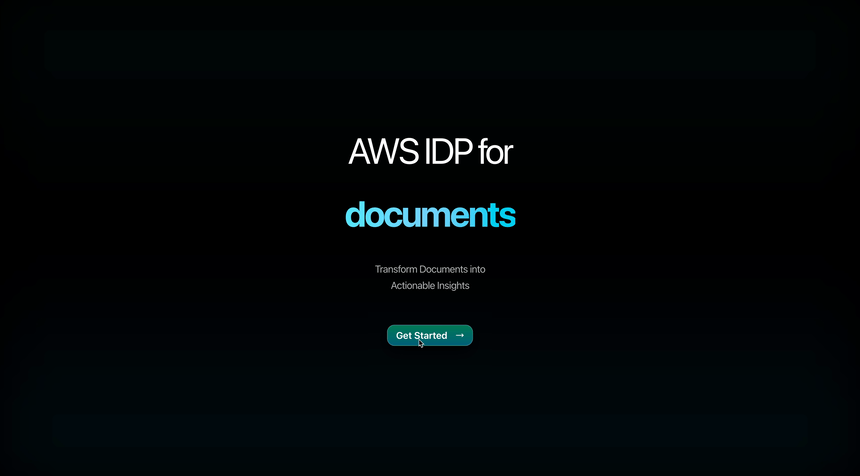
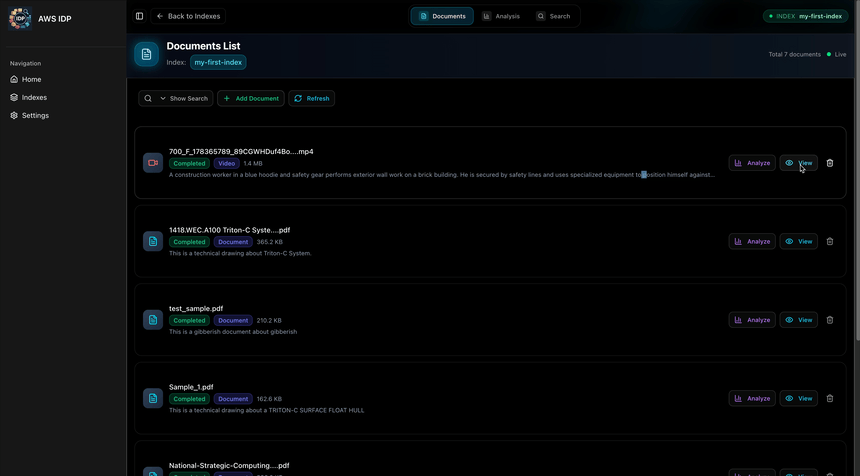
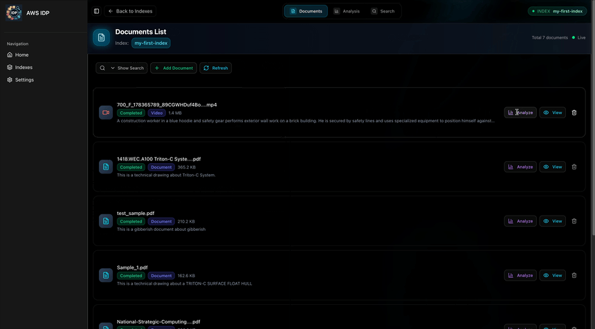
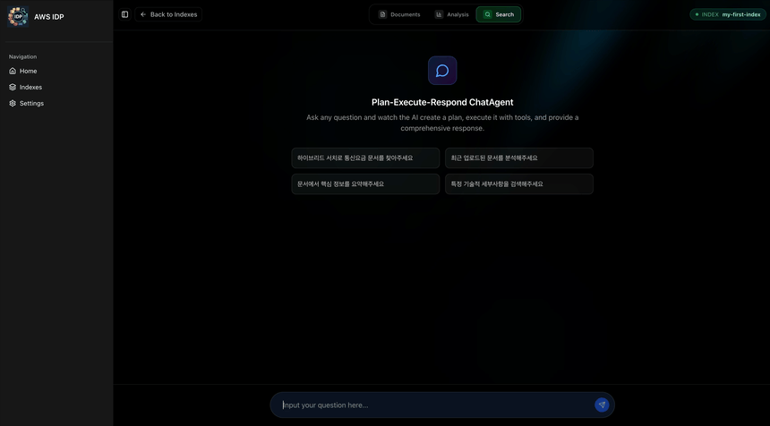
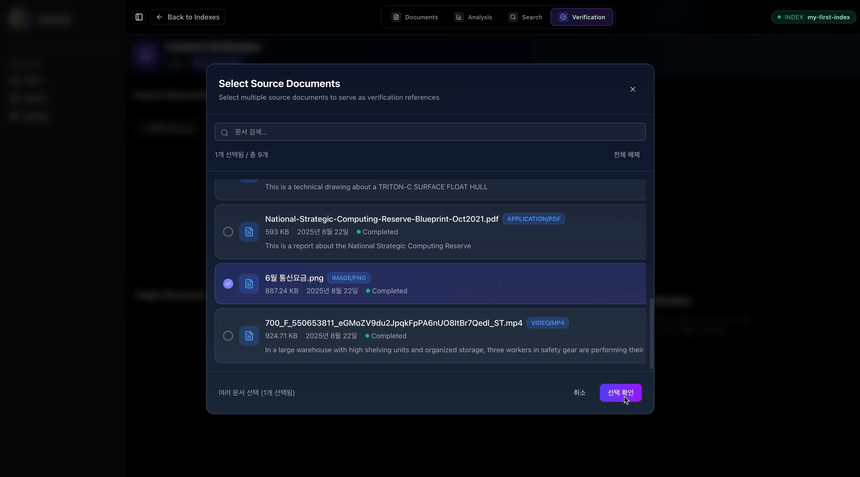

# Application Demo

---

## Part 1: Data Ingestion & Indexing

In OpenSearch, an **Index** serves as a logical container where all data is stored.  
This demo shows the process of creating an Index and ingesting data when a user starts a project.

### 1. Index Creation

Click the **Get Started** button on the home screen to go to the Studio.  
- If an Index already exists, you can select it and upload files for analysis.  
- If there is no Index, click **Create an index** to create a new one.  

    

The following fields are required when creating an Index:
- **Index ID**: OpenSearch index ID. Rules:
  - Use only lowercase English letters
  - Cannot start with `_` or `-`
  - No spaces or special characters ( , : " * + / \ | ? # > < )
- **Description**: Description of the index
- **Owner**: Owner of the index

Once the Index is created, uploading files will automatically trigger analysis.

### 2. Data Analysis

After uploading files, analysis is performed automatically. Supported file types include images, documents (PDF, Word, etc.), and videos.
Files up to 500MB are supported, and all files are uploaded directly to cloud storage.

#### Processing Unit & Parallel Execution

- **Image**: Processed per file (1 image = 1 processing unit).
- **Document**: Analysis is performed **per page**.
- **Video**: Analysis is performed **per section (segment)**.

Each page/section is analyzed **in parallel**, with a default **concurrency of 10**. This value can be adjusted in the **AWS Console's Step Functions** (State Machine) as needed.

---

## Part 2: Intelligent Retrieval & Utilization

### 1. Document List Tab

- **Features**: View the list of documents for the selected Index, add new documents, or delete existing documents.  
- **Additional Features**: View detailed contents of analyzed documents.  

### 2. Analysis Tab

- **Features**: View the results of analysis already performed on a specific document and use them to answer questions.  
- **How to Use**: Enter questions conversationally with the document at hand; the system responds based on stored analysis results.  
- **Use Cases**: Quickly check details such as technical specifications, safety regulations, or design changes contained in the document.  
- **Image Viewing Tool**: If analysis results are insufficient or require further review, you can view the original images used in the analysis. The LLM can take these images as input for additional analysis and provide more precise answers.  

### 3. Search Tab

- **Features**: Perform searches based on all documents stored in the Index, not just a single document.  
- **How it Works**: The user's question is semantically analyzed to find relevant documents and pages, and answers are generated based on the results.  
- **Characteristics**: Supports hybrid search combining keyword search and vector (embedding-based semantic) search.  
- **Architecture Pattern**: Based on the Agent pattern, using a **Plan and Execute** approach to plan and perform search tasks.  

### 4. Verification Tab

- **Features**: Compare source documents against a target document to automatically verify factual consistency.
- **Use Cases**: 
  - Report validation (final report vs source data)  
  - Summary validation (AI-generated summary vs original text)  
  - Translation validation (translation vs original meaning)  
  - Fact-checking (news or articles)  
- **How it Works**:  
  1. Select documents (multiple source docs + one target doc)  
  2. Automated verification pipeline: Initialization → Document Loading → Claim Extraction → Claim Verification → Summary Generation  
  3. Results are categorized as:  
     - VERIFIED (consistent, green)  
     - CONTRADICTED (inconsistent, red)  
     - NOT_FOUND (missing information, yellow)  

