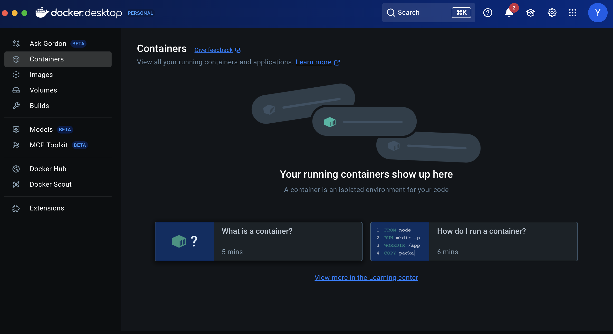
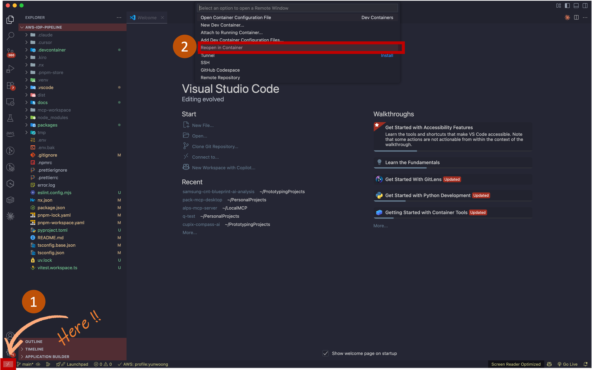

<h2 align="center">Devcontainer 설정 가이드 (Kor)</h2>

이 가이드는 Devcontainer에서 개발 환경 설정을 위한 자세한 단계별 안내를 제공합니다. **6단계**까지 따라하면 완전한 로컬 개발 환경이 구축됩니다. 선택 사항인 **7단계**는 전체 애플리케이션을 AWS ECS에 배포하여 외부에서 접근 가능한 실행 환경을 만드는 방법을 설명합니다.

---

## 사전 준비 사항

시작하기 전에 **로컬**에 다음 소프트웨어와 구성이 준비되어 있는지 확인하세요.

1.  **Devcontainer를 지원하는 IDE**
    
    *   [**Visual Studio Code**](https://code.visualstudio.com/download) 또는 [**Cursor**](https://cursor.sh/)
    
2.  **Docker Desktop**
    
    *   컨테이너를 구동하는 엔진입니다. 반드시 **설치되어 실행 중이어야** 합니다.
    *   [공식 Docker 웹사이트](https://www.docker.com/products/docker-desktop/)에서 다운로드하세요.
    
3.  **AWS 자격 증명:**
    
    * 로컬 머신에 [AWS CLI가 설치](https://docs.aws.amazon.com/cli/latest/userguide/getting-started-install.html)되어 있고 구성되어 있어야 합니다. 다음 명령어로 프로필을 생성할 수 있습니다.
    
      ```bash
      aws configure --profile your-profile-name
      ```
    
    *   `~/.aws/credentials` 및 `~/.aws/config` 파일에 이름이 지정된 프로필이 설정되어 있어야 합니다. Devcontainer는 이 Directory를 자동으로 마운트하여 컨테이너 내에서 프로필을 사용할 수 있습니다.

---

## 설정 절차

### 1단계: Docker Desktop 설치 및 실행

운영 체제에 맞는 Docker Desktop을 다운로드하여 설치하세요. 설치 후에는 **애플리케이션을 시작하여** 백그라운드에서 실행되도록 하세요.

<div align="center">   
  
</div>


### 2단계: VS Code에서 프로젝트 열기

1.  이 저장소를 로컬 머신에 클론하세요.
2.  VS Code에서 `File > Open Folder...`로 이동하여 복사한 프로젝트의 Root Directory를 선택하세요.

### 3단계: Devcontainer 실행

1.  **명령 팔레트**를 열기 (`Ctrl+Shift+P` 또는 macOS에서는 `Cmd+Shift+P`).
2.  팔레트에 `Reopen`을 입력하고 **"Dev Containers: Reopen in Container"**를 선택하세요.

<div align="center">   
   
</div>

> **Devcontainer 진행 과정**
> "Reopen in Container"를 클릭하면 인프라 배포를 위한 환경 구성 프로세스가 자동으로 진행됩니다. VS Code와 Docker가 협력하여 `devcontainer.json`에 정의된 환경을 빌드합니다.
>
> *   **Python 3.12 컨테이너 이미지**가 다운로드됩니다.
> *   AWS CLI, Node.js, Docker 같은 필수 도구가 설치됩니다.
> *   로컬 **AWS 자격 증명**이 안전하게 마운트됩니다.
> *   `uv`와 `pnpm`을 사용하여 모든 Python 및 Node.js 의존성이 설치되는 설정 스크립트가 실행됩니다.
> *   Prettier와 ESLint 같은 유용한 **VS Code 확장 기능**이 자동으로 설치됩니다.

### 4단계: AWS 인프라 배포

Devcontainer 빌드가 완료되면 핵심 AWS 인프라를 배포하세요.

1.  VS Code에서 명령 팔레트 (`Ctrl+Shift+P`)를 열고 `터미널: 새 터미널`을 실행하세요.
2.  다음 명령어를 실행하세요.

```bash
# 인프라 패키지로 이동
cd packages/infra

# AWS 프로필 이름과 함께 배포 스크립트 실행
./deploy-infra.sh your-aws-profile-name
```

> **배포 소요 시간 및 확인**
>
> *   인프라 배포는 완료까지 **40~60분** 정도 걸릴 수 있습니다. 대부분의 시간은 Amazon OpenSearch 클러스터 프로비저닝에 소요됩니다.
> *   **배포가 성공적으로 완료되면** AWS OpenSearch 콘솔로 이동하여 `nori` (한국어 형태소 분석기) 플러그인이 도메인에 올바르게 설치되었는지 확인하세요. 플러그인 패키지 설치에는 추가로 **10~20분** 정도 소요될 수 있습니다.

### 5단계: 로컬에서 애플리케이션 실행

개발을 위해 로컬 머신에서 애플리케이션을 실행하려면 두 개의 별도 터미널이 필요합니다. VS Code에서 새 터미널을 쉽게 만들거나 현재 터미널을 분할할 수 있습니다.

**터미널 1: 백엔드 시작**

1.  새 터미널에서 프로젝트 루트(`/workspaces/aws-idp-pipeline`)에 있는지 확인하세요.
2.  Python 가상환경 활성화
    ```bash
    source .venv/bin/activate
    ```
3.  백엔드 서버 시작
    ```bash
    python packages/backend/main.py
    ```

**터미널 2: 프론트엔드 시작**

1.  다른 새 터미널을 엽니다.
2.  프론트엔드 개발 서버 시작
    ```bash
    pnpm dev
    ```

### 6단계: 로컬 애플리케이션 접속

백엔드와 프론트엔드가 모두 실행 중이면 웹 브라우저에서 아래 주소로 접속하세요.

**[http://localhost:3000](http://localhost:3000)**

---

### 7단계 (선택 사항): AWS ECS에 배포

이 단계는 AWS ECS와 애플리케이션 로드 밸런서(ALB)를 사용하여 공개 환경에 애플리케이션을 배포하는 방법입니다. 다른 사람과 접근을 공유하거나 스테이징 환경에 유용합니다.

**1. IP 화이트리스트 구성**

보안을 위해 배포된 애플리케이션 접근은 IP 화이트리스트로 제한됩니다. 배포 전에 자신의 IP 주소를 이 목록에 추가해야 합니다.

* **내 IP 확인 방법:** **로컬 머신 터미널**에서 다음 명령을 실행하세요 (Devcontainer 내부가 아닌 로컬에서)

  ```bash
  curl ifconfig.me
  ```
* **설정 파일 편집:** `packages/infra/.toml` 파일을 엽니다.
* **IP 주소 추가:** `[security]` 섹션을 찾아 `whitelist`에 IP 주소를 CIDR 형식으로 추가하세요. 단일 IP일 경우 끝에 `/32`를 붙입니다.

```toml
[security]
# ALB 접근 제어를 위한 IP 화이트리스트
# 허용할 IP 주소 또는 CIDR 블록을 여기에 추가하세요
whitelist = [
  "15.248.0.0/16",
  "219.250.0.0/16",
  "YOUR_IP_ADDRESS/32"  # <-- 여기에 IP 추가
]
```

**2. 서비스 배포**

터미널에서 서비스 배포 스크립트를 실행하세요.

```bash
# 아직 인프라 패키지에 있지 않다면 이동
cd packages/infra

# AWS 프로필과 함께 서비스 배포 스크립트 실행
./deploy-services.sh your-aws-profile-name
```

**3. 배포된 애플리케이션 접속**

*   스크립트가 완료되면 프론트엔드의 공개 URL이 출력됩니다.

    ```
    Service URLs:
      Frontend:    http://your-alb-dns-name.amazonaws.com
    ```
*   이 URL은 프로젝트 루트의 자동 생성된 `.env` 파일 내 `FRONTEND_URL` 키에서도 확인할 수 있습니다.
*   출력된 URL을 브라우저에서 접속하세요. IP 주소가 변경되면 `.toml` 파일에 새 IP를 추가하고 `./deploy-services.sh` 스크립트를 다시 실행해야 합니다.

---

**배포 완료!** 로컬 또는 ECS에서 AWS IDP를 테스트 할 준비가 되었습니다.
