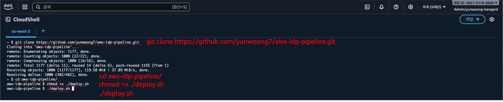
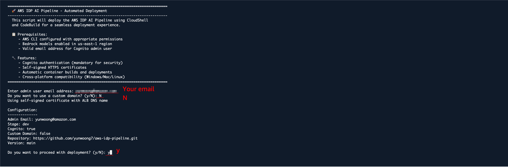
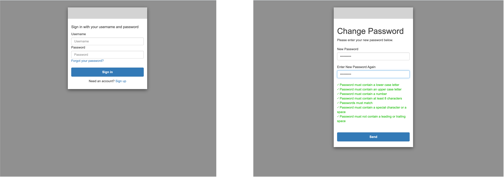

<h2 align="center">CloudShell & CodeBuild Quick Deployment Guide</h2>

This document explains how to deploy AWS IDP easily using AWS CloudShell and CodeBuild without any local environment setup.

---

## Prerequisites

### Bedrock Model Access Setup

In the us-west-2 region, go to the **Bedrock Model access** page → click **Manage model access** → check all models you intend to use → click **Save changes**.

## Deployment Steps

### 1. Launch CloudShell

Click the CloudShell icon in the top-right of the AWS Management Console to launch CloudShell. CloudShell is a browser-based shell environment provided by AWS, allowing you to manage AWS resources without local setup.

### 2. Fetch the source code

<div align="center">   
  
</div>


```bash
git clone https://github.com/your-repo/aws-idp-pipeline.git
cd aws-idp-pipeline
chmod +x deploy.sh
./deploy.sh
```

### 3. Provide inputs during execution

<div align="center">   
  
</div>

- Enter admin user email address: This email address will be used for the administrator login.
- Do you want to use a custom domain? (y/N): Enter `N` for now.
- Do you want to proceed with deployment? (y/N): Enter `y` to proceed with deployment.

Deployment will then continue in CodeBuild.

### 4. Monitor the deployment

You can monitor progress in the CodeBuild console. Check build logs to ensure there are no errors.

## After deployment

When deployment completes, you can find the following values in the CodeBuild log output:

<div align="center">   
  
</div>

- FrontendURL (Application access URL)
- AdminUsername (Administrator username)
- TemporaryPassword = TempPass123! (Temporary password)

Users can access the application via the Frontend URL and log in using the AdminUsername and TemporaryPassword. You must change the temporary password after the first login.

<div align="center">   
  
</div>
