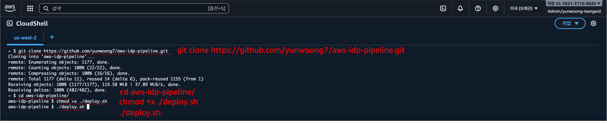
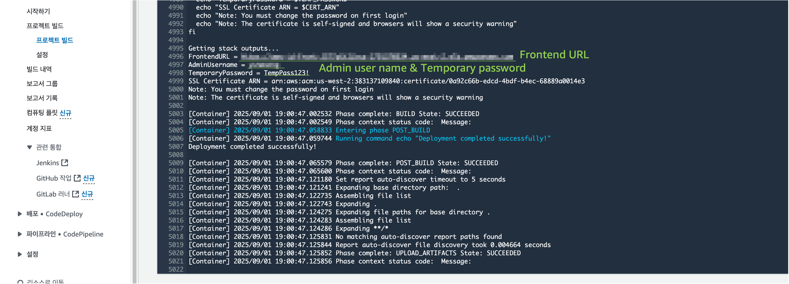
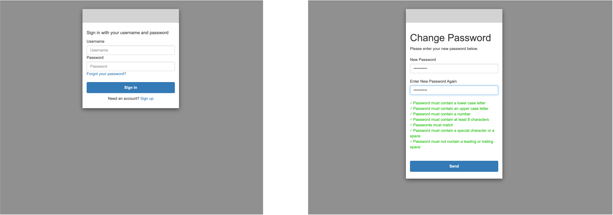

<h2 align="center">CloudShell & CodeBuild 빠른 배포 가이드 (Kor)</h2>

이 문서는 AWS CloudShell과 CodeBuild를 활용하여 로컬 환경 설정 없이 간단하게 AWS IDP를 배포하는 방법을 안내합니다.

---

## 사전 준비 사항

### Bedrock 모델 액세스 설정

us-west-2 리전에서 **Bedrock Model access** 메뉴로 이동합니다. → **Manage model access** → 사용하려는 모든 모델을 체크한 뒤 **Save changes**를 클릭합니다.

## 배포 단계

### 1. CloudShell 실행

AWS Management Console 우측 상단의 CloudShell 아이콘을 클릭하여 CloudShell을 실행합니다. CloudShell은 AWS에서 제공하는 브라우저 기반 쉘 환경으로, 별도의 로컬 설정 없이 AWS 리소스를 관리할 수 있습니다.

### 2. 소스 코드 가져오기

CloudShell 터미널에 다음 명령어를 입력하여 배포 스크립트 및 소스 코드를 클론합니다.

<div align="center">   
  
</div>


```bash
git clone https://github.com/your-repo/aws-idp-pipeline.git
cd aws-idp-pipeline
chmod +x deploy.sh
./deploy.sh
```

### 3. 실행 중 입력값 제공

배포 스크립트를 실행하면 다음과 같은 인터랙티브 프롬프트가 나타납니다.

<div align="center">   
  
</div>

- `Enter admin user email address:`  이 이메일 주소는 로그인 시 사용할 관리자 이메일입니다.
  
- `Do you want to use a custom domain? (y/N):`  여기서는 `N`을 입력합니다.
  
- `Do you want to proceed with deployment? (y/N):`  여기서는 `y`를 입력하여 배포를 진행합니다.

이후 배포는 CodeBuild에서 진행됩니다.

### 4. 배포 모니터링

CodeBuild 콘솔에 접속하여 배포 진행 상황을 모니터링할 수 있습니다. 빌드 로그를 확인하며 에러가 발생하지 않는지 확인하세요.

## 배포 완료 후

배포가 완료되면, CodeBuild 로그 출력에서 다음과 같은 값을 확인할 수 있습니다.

<div align="center">   
  
</div>

- FrontendURL (애플리케이션 접속 URL)
- AdminUsername (관리자 사용자 이름)
- TemporaryPassword = TempPass123! (임시 비밀번호)

사용자는 Frontend URL을 통해 애플리케이션에 접속할 수 있으며, AdminUsername과 TemporaryPassword를 사용하여 로그인할 수 있습니다. 최초 로그인 시에는 임시 비밀번호를 반드시 변경해야 합니다.

<div align="center">   
  
</div>
