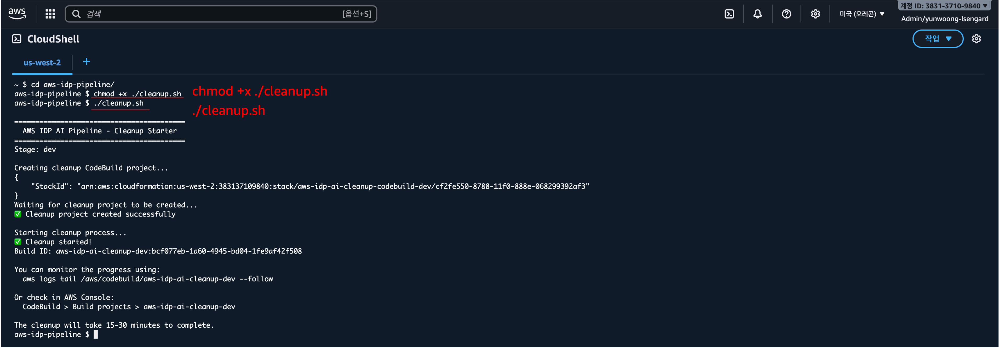
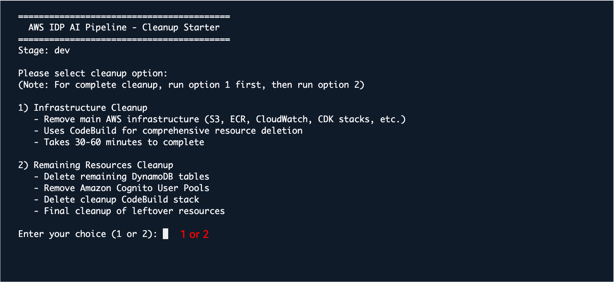
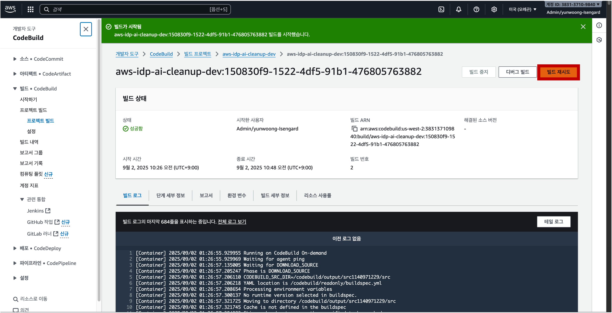
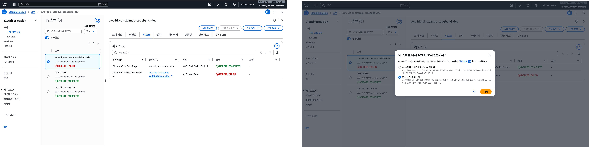

<h2 align="center">CloudShell & CodeBuild Infrastructure Deletion Guide</h2>

This document explains how to safely delete the AWS IDP infrastructure that was deployed using AWS CloudShell and CodeBuild.

## Prerequisites

- You must have permission to run CloudShell.
- You need permissions to access the relevant CodeBuild project.
- Make sure to select the same AWS Region where the deployment was performed.

## Deletion Steps

1. Launch CloudShell.

2. Fetch the source code. If you have already cloned the repository, you can skip this step. However, if you are starting a fresh CloudShell session, run the following commands again:
   ```
   git clone https://github.com/your-repo/aws-idp-pipeline.git
   cd aws-idp-pipeline
   ```

3. Run the deletion script (`cleanup.sh`).

4. <div align="center">   
     
   </div>

   ```
   chmod +x cleanup.sh && ./cleanup.sh
   ```
   If you are not using CloudShell, you can run the script locally from the repository path:
   ```
   chmod +x packages/infra/cleanup.sh && ./packages/infra/cleanup.sh
   ```

### Deletion Options (when running cleanup.sh)

When executed, you will be prompted to choose one of two options. For a complete cleanup, run option 1 first, then run the script again and choose option 2.

<div align="center">   

</div>

1) Infrastructure Cleanup
   - Removes core infrastructure resources (S3, ECR, CloudWatch, major CDK stacks, etc.)
   - Uses CodeBuild to orchestrate broad resource deletion; typically takes 30–60 minutes

2) Remaining Resources Cleanup
   - Deletes remaining DynamoDB tables
   - Deletes Amazon Cognito User Pools
   - Removes the cleanup CodeBuild stack (`aws-idp-ai-cleanup-codebuild-<stage>`)
   - Final pass to clean up any leftover resources

## Monitoring Deletion

- You can monitor the deletion progress in the AWS CodeBuild console.
- If deletion takes a long time or fails due to a timeout, you can click the "Retry build" button in CodeBuild to restart the deletion process.

<div align="center">   

</div>

## After Deletion Completes

- Check the CodeBuild logs to confirm the completion message.

- Verify that key resources such as S3 buckets, DynamoDB tables, OpenSearch, Lambda, and Step Functions have been removed successfully.

- In most cases the deletion will succeed. However, if some resources remain, go to the CloudFormation console and manually delete any remaining stacks.

<div align="center">   

</div>


