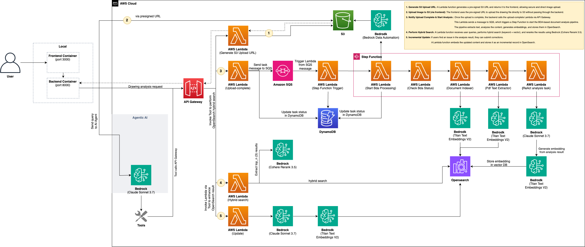
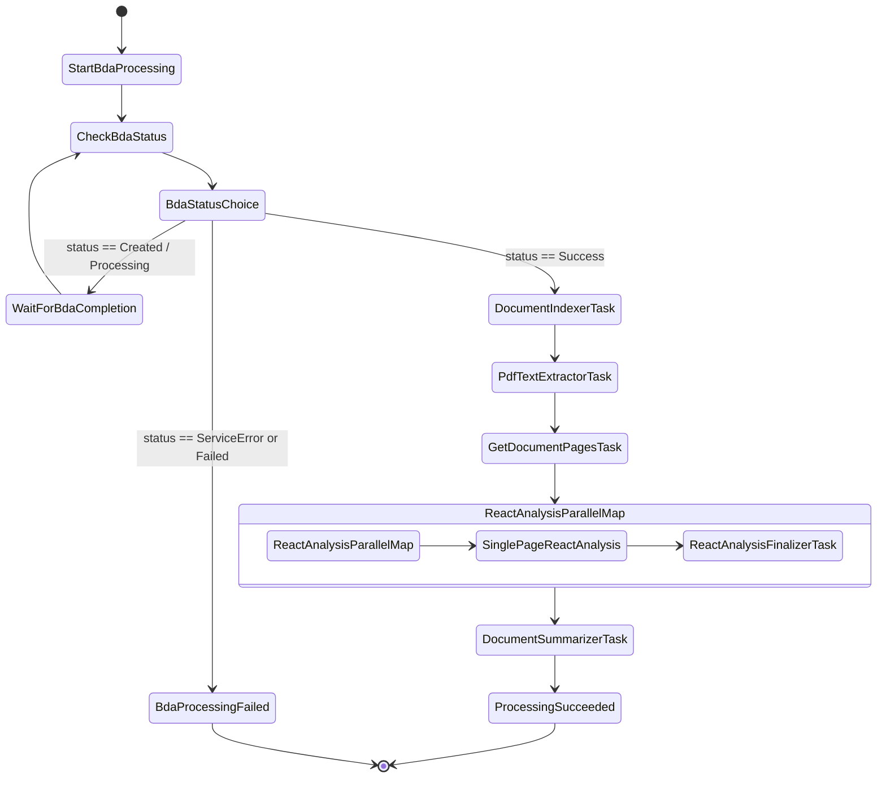

<h2 align="center">
 AWS IDP AI Analysis - Infrastructure
</h2>
<div align="center">
  
  
  
  
  
  
  
  
</div>


## Overview

**AWS IDP AI Analysis Infrastructure** is a comprehensive AWS cloud infrastructure built with CDK for the document processing and analysis system. It provides a scalable serverless architecture supporting the entire workflow from document upload to AI analysis using an Infrastructure as Code (IaC) approach for reliable and repeatable deployments.

## Architecture Overview

<div align="center">
  
</div>

## Data Schema: OpenSearch

The core data, including analysis results and vector embeddings, is stored in OpenSearch. The index is structured to support hybrid search and detailed data retrieval for various media types.

```json
{
    "settings": {
        "number_of_shards": 1,
        "number_of_replicas": 1,
        "knn": true,
        "knn.algo_param.ef_search": 100
    },
    "mappings": {
        "properties": {
            "document_id": {"type": "keyword"},
            "segment_id": {"type": "keyword"},
            "segment_index": {"type": "integer"},
            "media_type": {"type": "keyword"},
            "created_at": {"type": "date"},
            "updated_at": {"type": "date"},
            "content_combined": {"type": "text"},
            "user_content": {
                "type": "nested",
                "properties": {
                    "content": {"type": "text"},
                    "created_at": {"type": "date"}
                }
            },
            "tools": {
                "type": "object",
                "properties": {
                    "bda_indexer": {"type": "nested"},
                    "pdf_text_extractor": {"type": "nested"},
                    "ai_analysis": {"type": "nested"}
                }
            },
            "vector_content": {
                "type": "knn_vector",
                "dimension": 1024,
                "method": {
                    "name": "hnsw",
                    "space_type": "cosinesimil",
                    "engine": "nmslib"
                }
            }
        }
    }
}
```

## Project Structure

```bash
infra/
├── config/
│   └── dev.toml                # Environment-specific configurations
├── src/
│   ├── main.ts                 # CDK app entry point, initializes all stacks
│   ├── stacks/                 # Core infrastructure stack definitions
│   ├── functions/              # Lambda function source code for each stack
│   ├── constructs/             # Reusable custom CDK constructs
│   └── lambda_layer/           # Shared Lambda Layer code and dependencies
├── deploy-infra.sh             # Script for core infrastructure deployment
└── deploy-services.sh          # Script for optional ECS services deployment
```

## Workflow Execution Flow

The document processing pipeline is orchestrated by AWS Step Functions. The following diagram illustrates the state transitions based on the logic in `workflow-stack.ts`.



# Deployment

For detailed deployment instructions, please refer to the setup guides in the root `docs` folder:
- [**Devcontainer Setup Guide**](../../docs/devcontainer_setup.md) (Recommended)
- [**Manual Local Setup Guide**](../../docs/manual_setup.md)